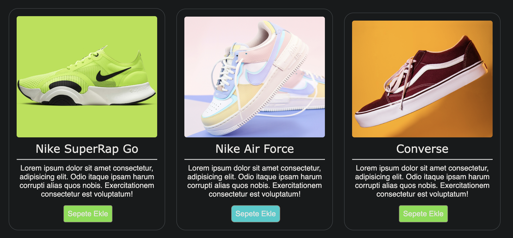

# 🛒 E-Ticaret Ürün Kartı / E-Commerce Product Card

Bu proje, HTML ve CSS kullanılarak oluşturulmuş modern bir e-ticaret ürün kartı bileşenidir. Ürün resmi, başlık, açıklama ve "Sepete Ekle" butonundan oluşur. Temiz ve responsive (mobil uyumlu) tasarımı sayesinde her seviyedeki geliştiriciler için uygundur.

This project is a modern e-commerce product card component built with HTML and CSS. It includes a product image, title, description, and an "Add to Cart" button. The design is clean and responsive, making it suitable for developers at any level.

---

## 📸 Önizleme / Preview

---

## 🚀 Özellikler / Features

- ✅ Modern ve temiz tasarım / Clean, modern design  
- ✅ HTML ve CSS ile yazılmıştır / Built with only HTML & CSS  
- ✅ Responsive yapı (mobil uyumlu) / Mobile-friendly layout  
- ✅ Kendi ürünlerinle kolayca özelleştirilebilir / Easy to customize with your own products  

---

## 🛠️ Kullanılan Teknolojiler / Technologies Used

- HTML5  
- CSS3 (Flexbox, basic styling)